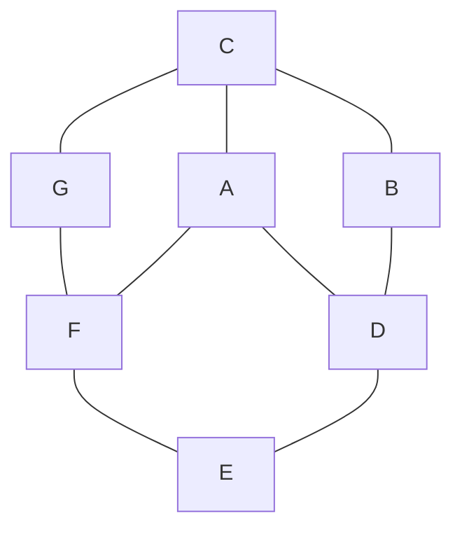

## Soal
**1.**
| no  |  P  | Q   | R   |  S  | 
|:---:|:---:| --- | --- |:---:|
|  1  |  T  | F   | T   |  F  |
|  2  |  T  | T   | T   |  T  |
|  3  |  F  | T   | F   |  F  |
|  4  |  T  | F   | F   |  F  |
|  5  |  F  | T   | T   |  F  |
|  6  |  F  | F   | F   |  T  |
|  7  |  T  | F   | T   |  F  |
|  8  |  F  | T   | T   |  F  |

$$(P \to Q)\to(R \to S)$$

**2.** 
A,B,C,D,E,F
Closenes Centrality

## jawaban

**1.**
| no  | $$P \to Q$$ | $$R \to S$$ | $$(P \to Q)\to(R \to S)$$ |
|:---:|:-----------:|:-----------:|:-------------------------:|
|  1  |      F      |      F      |             T             |
|  2  |      T      |      T      |             T             |
|  3  |      T      |      T      |             T             |
|  4  |      F      |      T      |             T             |
|  5  |      T      |      F      |             F             |
|  6  |      T      |      T      |             T             |
|  7  |      F      |      F      |             T             |
|  8  |      T      |      F      |             F             |

2.
